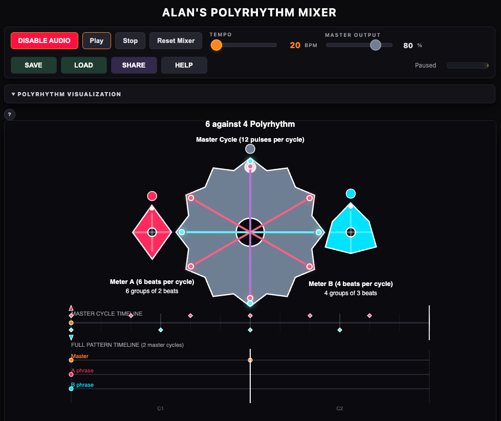

# Polyrhythm Mixer

A web-based tool for visualizing, sequencing, and mixing polyrhythms. Two interlocking gear-like wheels rotate inside a master wheel against a 4/4 beat, with interactive sequencer lanes and synthesized percussion sounds.



## Origin

This project was inspired by earlier work at UC Berkeley's [Center for New Music and Audio Technologies (CNMAT)](https://cnmat.berkeley.edu/) by author **Alan Potosnak** and collaborators **Garo Hussenjian** and **Kit Anderson**, who built a MAX/MSP tool for creating polyrhythms for live performance. The web version preserves the same musical concepts — meter relationships, phrase structures, and phase offsets — in a portable, shareable format.

## Architecture

The **audio clock drives the visual**. The master wheel angle is computed from the Web Audio API's hardware clock (`audioCtx.currentTime`) rather than from frame deltas. A self-adjusting scheduling loop pre-schedules sounds at precise hit times ahead of the rendering thread, while `requestAnimationFrame` handles only the gear animation, step highlighting, and flash effects.

## Features

- **Polyrhythm sequencers** — Meter A and Meter B pulse lanes with individual tooth selection; each tooth lights up independently on click and triggers its own sound, gear dot, and spoke
- **Multi-voice phrase lanes** — Master, Meter A Phrase, and Meter B Phrase lanes each support independent voices with per-voice patterns, instruments, and controls
- **Per-lane controls** — Instrument select, volume, solo, and mute are colocated with each sequencer
- **Master Beat reference strip** — 4/4 click track displayed alongside the polyrhythm beat scheme
- **Gear visualization** — Grey 4/4 spokes, pink (A) and cyan (B) meter spokes, and magenta overlap where they land on the same tooth; colored dots mark active pulse positions
- **Cycle navigation** — Multi-cycle phrase support with ◀/▶ browsing and auto-follow playhead
- **Instrument tuning pages** — Interactive parameter tuning for hybrid and membrane families (`tuners/hybrid.html`, `tuners/membrane.html`)
- **Synthesized percussion** — 16 instruments generated in real-time via Web Audio API (oscillators, noise, filters)
- **Tempo control** — 20–180 BPM, quarter-note = beat
- **Save / Load / Share** — Named rhythms stored in localStorage; share links encode full state as a URL parameter
- **Responsive layout** — Works on desktop and mobile

## Instrument Library

All sounds are synthesized in real-time:

- **Membrane**: Bass Drum (Kick), Synth Electronic Tom, Talking Drum, Udu Clay Pot
- **Hybrid**: Bongo Low (Hembra), Bongo High (Macho), Conga Low, Conga Middle, Conga High, Conga Slap, Snare Drum, Electronic Snare, Timbale, Hand Slap, EDM Synth Kick, Djembe, Frame Drum (Tar)
- **Cajón**: Traditional Cajon Bass, Traditional Cajon Slap, Snare Cajon Bass, Snare Cajon Slap

## How to Use

1. **Pick a polyrhythm** — Select Meter A and Meter B values (2–18)
2. **Enable audio** — Press Enable Audio (required by browser autoplay policy)
3. **Tap steps** — Click individual teeth in the Meter A / Meter B pulse lanes to toggle hits
4. **Add voices** — Click + Voice on the Master, A Phrase, or B Phrase lanes for layered patterns
5. **Extend phrases** — Set Phrase Length to 2–4 cycles for longer repeating patterns
6. **Choose sounds** — Each lane and voice has its own instrument select, volume, solo, and mute
7. **Save or Share** — Save stores rhythms locally; Share copies a URL encoding the full state

## Share Links & Versioning

Share payloads are compressed (DEFLATE) and Base64URL-encoded with a `z:` prefix. Each payload carries a version number with automatic migration on load (v0 → v4). Saved rhythms use the same format in localStorage.

## Technical Notes

- **No build step** — Plain ES modules served as a static site (GitHub Pages)
- **Audio-clock architecture** — All timing is derived from the Web Audio hardware clock; visual rendering is passive
- **Modular codebase** — `lane-ui.js`, `scheduler.js`, `render.js`, `share.js`, `instruments.js`, etc.
- **Shared synthesis data** — `instrument-data.js` is the single source of truth; both the app and tuner pages import from it
- **Per-tooth scheduling** — Each tooth in a wheel lane is independently scheduled, selected, and visualized

## Running Locally

```bash
python3 -m http.server 8080
# Open http://localhost:8080
```

## Regression Testing

```bash
npm install --save-dev playwright
npx playwright install chromium
node scripts/regression-smoke.js
```

## License

[MIT](LICENSE)
